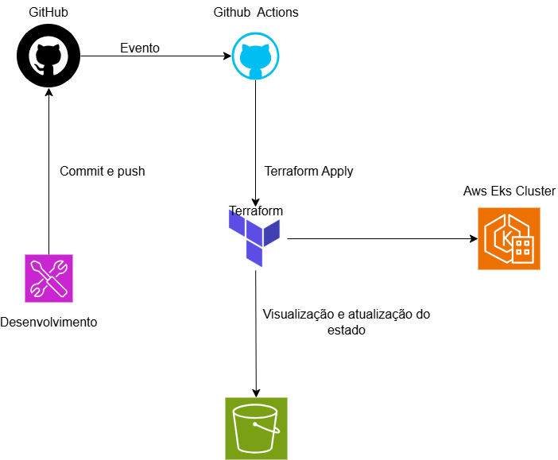

# 🚀 Automated AWS Infrastructure with Terraform & GitHub Actions

Este repositório contém uma solução completa de **Infraestrutura como Código (IaC)** para provisionamento automatizado de recursos na AWS utilizando **Terraform** e integração contínua com **GitHub Actions**.

O projeto segue boas práticas de DevOps e Cloud Infrastructure, incluindo:

* Backend remoto com Amazon S3
* Pipeline CI/CD automatizado
* Gestão segura de credenciais com GitHub Secrets
* Estrutura modular e escalável
* Automação completa do deployment

---

# 🏗️ Arquitetura da Solução

O fluxo abaixo representa o ciclo completo de automação da infraestrutura:

1. O desenvolvedor realiza um `git push` para a branch `main`
2. O GitHub Actions executa automaticamente o pipeline
3. O Terraform inicializa o backend remoto no S3
4. O plano e aplicação da infraestrutura são executados
5. Os recursos são provisionados automaticamente na AWS

---

## 📸 Visualização da Arquitetura

O diagrama abaixo representa o fluxo completo de automação da infraestrutura, desde o commit do desenvolvedor até o provisionamento automatizado na AWS utilizando Terraform e GitHub Actions.




---

# 📂 Estrutura do Projeto

```bash
├── .github/
│   └── workflows/
│       └── terraform.yml       # Pipeline automatizado GitHub Actions
│
├── images/
│   └── Untitled Diagram.drawio.svg  # Diagrama da arquitetura em formato vetorial
│
├── src/
│   ├── main.tf                 # Recursos principais AWS
│   ├── provider.tf             # Provider AWS + Backend S3
│   ├── variables.tf            # Declaração de variáveis
│   ├── terraform.tfvars        # Valores locais das variáveis
│   └── outputs.tf              # Outputs da infraestrutura
│
└── README.md
